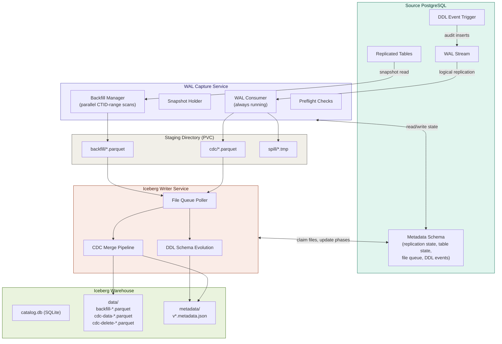
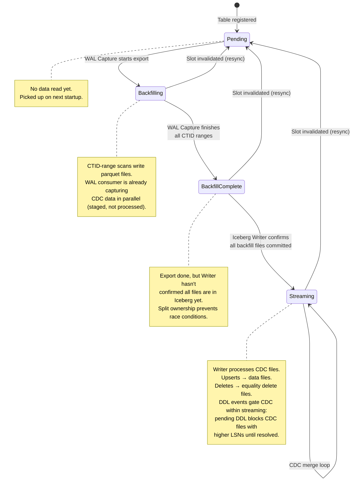
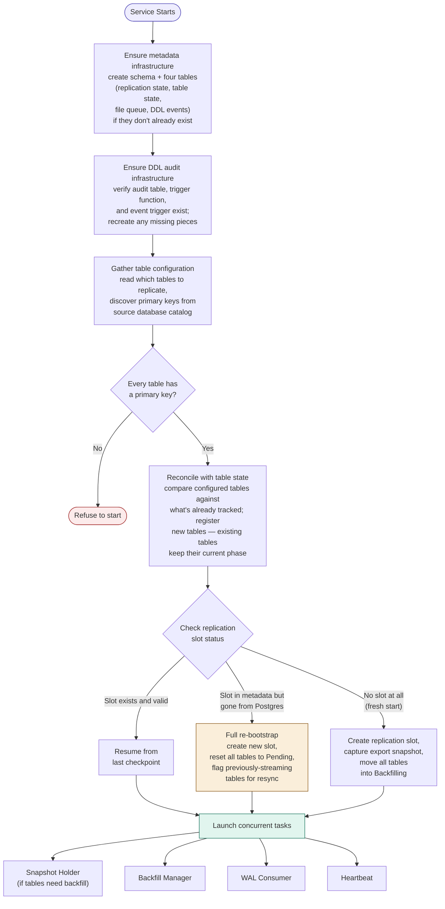
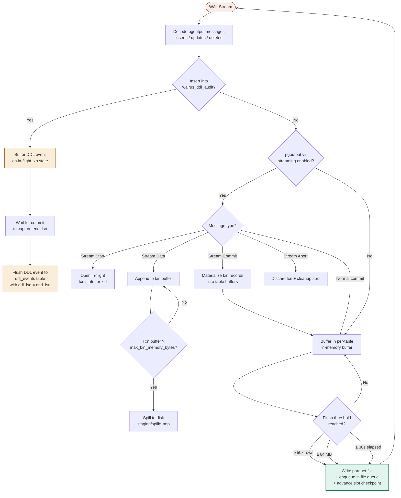
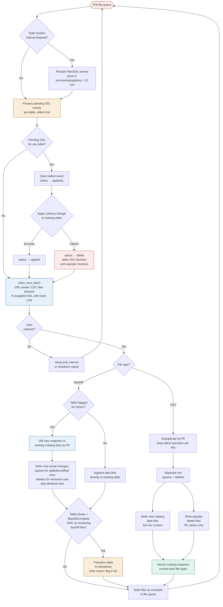
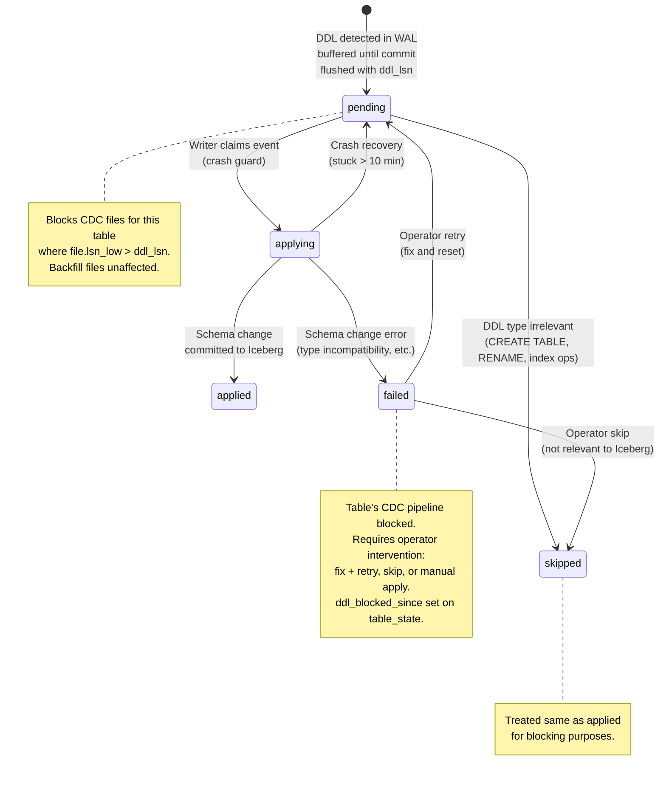
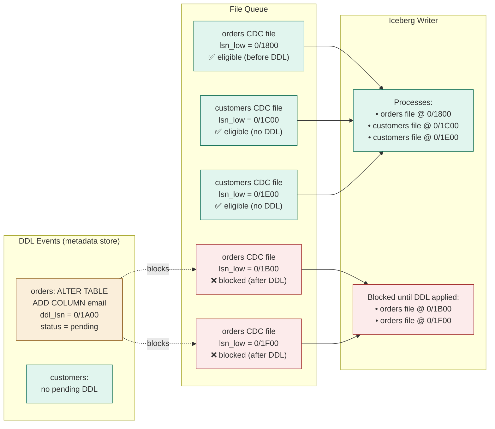
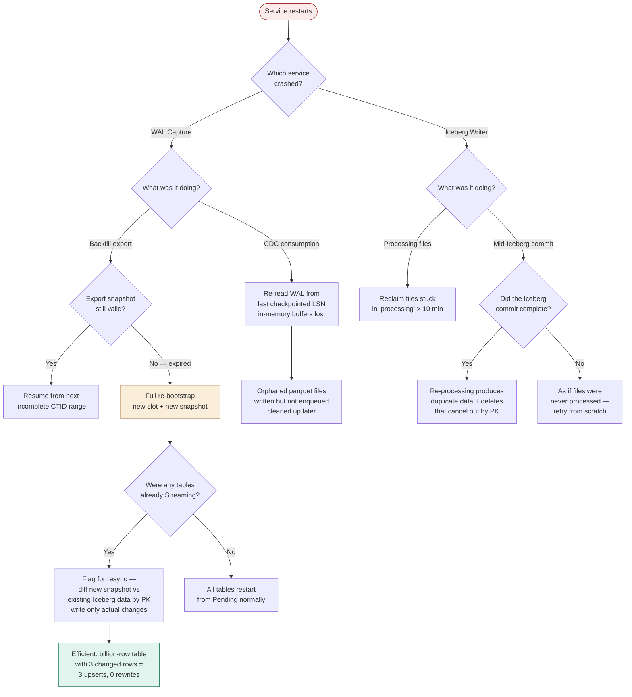
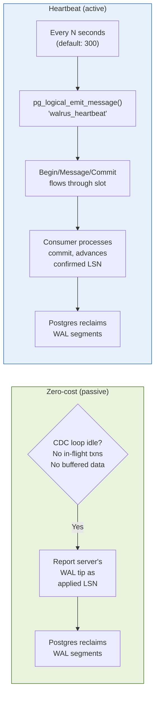

# Walrus — Workflow Diagrams

## High-Level Architecture

## Table Lifecycle State Machine

## Table State — Who Changes What

The table state metadata is shared between the two services, but each service owns specific transitions and fields. WAL Capture drives a table from registration through export, while the Iceberg Writer drives it from export-complete into live streaming. Neither service touches the other's fields.

```mermaid
flowchart TD
    subgraph WalCapture["WAL Capture"]
        Register["Register table<br/>+ discover primary keys<br/>+ record export plan"]
        Export["Export CTID ranges<br/>+ track partition progress"]
        ExportDone["Mark export complete"]
        SlotLost["Slot invalidation<br/>reset all tables to Pending<br/>flag streaming tables for resync"]
    end

    subgraph IcebergWriter["Iceberg Writer"]
        AbsorbBackfill["Absorb backfill files<br/>+ track writer progress"]
        ResyncMerge["Resync merge complete<br/>clear resync flag"]
        Promote["Promote to Streaming<br/>only when all backfill<br/>files are in Iceberg"]
        CommitCDC["Commit CDC batch<br/>+ advance committed LSN"]
    end

    subgraph TableState["Table State"]
        Phase["phase"]
        BackfillProgress["backfill progress<br/>(total partitions,<br/>done partitions,<br/>snapshot name)"]
        PKCols["primary key columns"]
        WriterProgress["writer progress<br/>(backfill files done,<br/>last committed LSN)"]
        StreamingSince["streaming since"]
        Resync["needs resync"]
    end

    Register -->|"phase → Backfilling"| Phase
    Register --> BackfillProgress
    Register --> PKCols

    Export --> BackfillProgress

    ExportDone -->|"phase → Backfill Complete"| Phase

    SlotLost -->|"phase → Pending<br/>reset all progress"| Phase
    SlotLost -->|"TRUE for formerly<br/>streaming tables"| Resync
    SlotLost --> BackfillProgress
    SlotLost --> WriterProgress

    AbsorbBackfill --> WriterProgress

    ResyncMerge -->|"FALSE"| Resync

    Promote -->|"phase → Streaming"| Phase
    Promote --> StreamingSince
    Promote -->|"FALSE"| Resync

    CommitCDC --> WriterProgress

    style WalCapture fill:#eeedfe,stroke:#534ab7,color:#26215c
    style IcebergWriter fill:#faece7,stroke:#993c1d,color:#4a1b0c
    style TableState fill:#f1efe8,stroke:#5f5e5a,color:#2c2c2a
    style SlotLost fill:#fcebeb,stroke:#a32d2d
    style Promote fill:#faeeda,stroke:#854f0b
```

## WAL Capture — Startup & Preflight

## CDC Processing Flow

## Iceberg Writer — Merge Pipeline

## DDL Event Status State Machine

## Per-Table DDL Blocking

## Crash Recovery Decision Tree

## Idle WAL Reclamation

